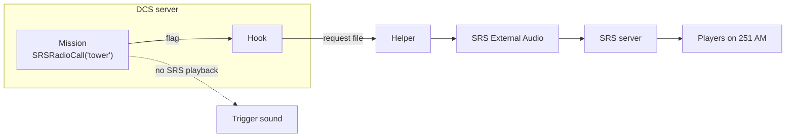

# dcs-srs-play-audio

Play a DCS mission's radio calls over SRS. A call is only heard by players tuned to its frequency, on that radio,
with their own SRS radio effects.

When SRS playback isn't available (single player, a server without this installed, SRS not running), the call falls
back to a normal trigger sound, so the same mission works everywhere.

Nothing to change in DCS's mission sandbox, and no scripting library in the mission.

Tested with a DCS 2.9.30 dedicated server and SRS 2.4.1.0.

## How it works



The mission sets a flag with the call's number. A DCS hook on the server reads it, copies the clip out of the `.miz`
and writes a request file. A small helper running next to DCS starts SRS's External Audio, which transmits the clip
on the call's frequencies.

The helper is needed because DCS's Lua can't start programs: `os.execute` does nothing and the dedicated server has no
`io.popen`.

## Install on a server

You need a Windows DCS dedicated server with the SRS server on the same machine, SRS External Audio
(`DCS-SR-ExternalAudio.exe`, it comes with SRS) and the .NET Desktop Runtime 10 x64 (the installer checks for it).

1. Download the zip, right-click > Properties > Unblock, and extract it on the server.
2. Signed in as the Windows user that runs DCS, run `install.cmd`. No admin rights needed.
3. Restart DCS.

The installer finds your DCS server profiles and External Audio, adds the hook to each profile and registers a
scheduled task, "DCS SRS play audio", that runs the helper at logon.

Options: `-DcsProfile <folder>`, `-ExternalAudio <path to exe>`, `-SrsPort <port>` if SRS isn't on 5002.

To remove it, run `uninstall.cmd` and restart DCS.

It won't work on hosted servers where you can't run a scheduled task.

## Add calls to a mission

1. Copy `mission/SRSRadioCalls.lua` and list your calls:

   ```lua
   SRS_RADIO_CALLS = {
       tower  = { file = 'tower.ogg',  freqs = '251', mods = 'AM', name = 'Tower' },
       wizard = { file = 'wizard.ogg', freqs = '305', mods = 'AM', name = 'Wizard' },
   }
   ```

2. Load it with a DO SCRIPT FILE action at mission start. Keep the file name.
3. Keep the clips in the mission with a trigger that never fires and a SOUND TO ALL action per clip, otherwise the
   editor drops them.
4. Play a call with a DO SCRIPT action: `SRSRadioCall('tower')`. If you want text on screen too, add a message
   action to the same trigger.

Optional fields: `coalition` (2 blue by default, 1 red, 0 everyone) and `volume` (0 to 1). Several frequencies:
`freqs = '251,305', mods = 'AM,AM'`.

Expect 1 to 1.5 s between the call and the audio. Don't overlap calls on the same frequency, they play on top of each
other.

## Fallback

`SRSRadioCall()` goes over SRS only while the server hook reports the helper running and the SRS port listening.
Otherwise it plays the clip with `trigger.action.outSoundForCoalition` (`outSound` for coalition 0): everyone hears
it, without frequency or radio effect.

## Demo

`demo/dcs-srs-play-audio-demo.miz`: Caucasus, Batumi, slots for the F/A-18C, TF-51D and Su-25T. Tune 124.0 AM and
251.0 AM, then use the F10 menu "SRS play audio demo". A welcome call plays 20 s after the start.

## DCS-SimpleTextToSpeech

[DCS-SimpleTextToSpeech](https://github.com/ciribob/DCS-SimpleTextToSpeech) also plays audio files over SRS through
External Audio, and does text to speech as well. It starts External Audio from the mission script, which works once
the server removes the sandbox in `MissionScripting.lua` and gives missions access to `os`, `io` and `lfs`.

This project keeps the sandbox: without it, any mission loaded on the server can run programs on the machine, so a
malicious `.miz` would be enough for remote code execution.

## Troubleshooting

- `dcs.log`: lines starting with `dcs-srs-play-audio:` show the calls found in the mission, whether the helper is
  ready, and each call played.
- `<Saved Games>\<profile>\dcs-srs-play-audio\helper.log`: what the helper started.
- `request-<n>.txt` in the same folder: External Audio's output.

## License

MIT. SRS and External Audio are by Ciribob:
[DCS-SimpleRadio-Standalone](https://github.com/ciribob/DCS-SimpleRadioStandalone).
